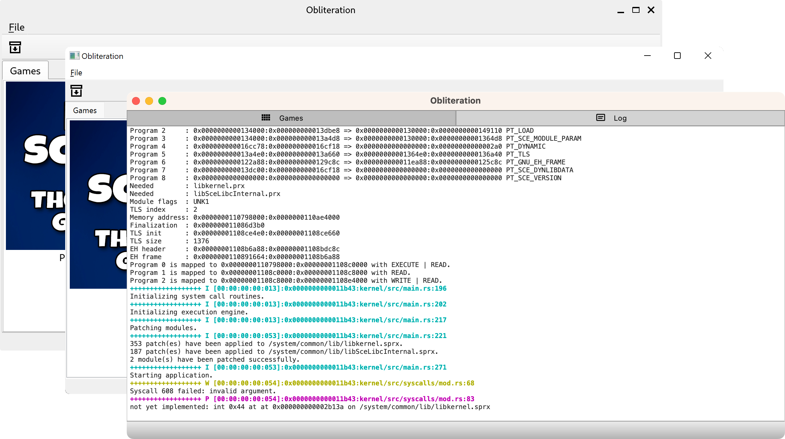

## About
 

Obliteration is an experimental PS4 emulator for Windows, Linux and macOS. **The project is under development and cannot run any games yet**. The reason it take so long is because we decided to go with the correct path without stubbing as much as possible.

This project started as a hard-fork from [Kyty](https://github.com/InoriRus/Kyty). Then we decided to rewrite the whole project from scratch by using Kyty and [Uplift](https://github.com/idc/uplift) as a reference to help us getting started with the project. How Obliteration work is totally different from Kyty because we decided to go with the same path as Uplift (and Spine?) instead of Kyty. This is the reason why Obliteration required firmware files from the PS4 in order to work while Kyty does not.

## Get a daily build

You can download binaries from the latest commits [here](https://github.com/obhq/obliteration/actions/workflows/main.yml). You **MUST** sign in to GitHub otherwise you will not be able to download files.

## Screenshots

Thanks to [VocalFan](https://github.com/VocalFan) for the awesome icon!

## Obliteration discussion

We have a Discord server for discussion about Obliteration and its development. You can join the server [here](https://discord.gg/Qsdaxj6tnH).

## Features

- [x] Cross-platform with native binary for each platform.
- [x] Built-in FTP client to pull the decrypted firmware from jailbroken PS4.
- [x] Built-in PKG file supports for Fake PKG.
- [x] Game library.
- [x] Emulate system calls instead of user-space libraries.

## System requirements

- Windows 10, Linux or macOS 11+.
- x86-64 CPU. We want to support non-x86 but currently we don't have any developers who are willing to work on this.
- CPU with hardware virtualization supports.
  - Windows and Linux users may need to enable this feature on the BIOS/UEFI settings.
- A jailbroken PS4 with FTP server that supports SELF decryption.

### Windows-specific requirements

- [Microsoft Visual C++ 2022 Redistributable](https://learn.microsoft.com/en-us/cpp/windows/latest-supported-vc-redist). If there is an error related to `msvcp140.dll`, `vcruntime140.dll`, or `vcruntime140_1.dll` that means you need to install this manually. It's likely your system already has it, so try to run Obliteration first.
- [Virtual Machine Platform](https://github.com/obhq/obliteration/wiki/Common-Issues)

### Linux-specific requirements

Obliteration supports only 4KB/8KB/16KB pages. Most people should not have any problem with this because 4KB is the default for most distros. A PR to support other page size is welcome.

## Building and Development

Information on building Obliteration and preparing to be a developer can be found on our [Wiki.](https://github.com/obhq/obliteration/wiki/Compilation-&-Development)

## License

- `src/ansi_escape.hpp`, `src/ansi_escape.cpp`, `src/log_formatter.hpp` and `src/log_formatter.cpp` are licensed under GPL-3.0 only.
- `src/param`, `src/pfs` and `src/pkg` are licensed under LGPL-3.0 license.
- All other source code is licensed under MIT license.
- All release binaries are under GPL-3.0 license.

### UI Icons

We use icons from https://materialdesignicons.com for UI (e.g. on the menu and toolbar).
