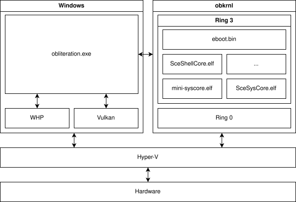

<p align="center"></p>

## About
[](https://github.com/obhq/obliteration/actions/workflows/main.yml)
[](https://obkrnl.zulipchat.com)

Obliteration is a free and open-source PlayStation 4 kernel rewritten in Rust. Our goal is not running on the PlayStation 4 but to run the dumped PlayStation 4 system software on Windows, Linux and macOS using a custom made virtualization stack optimized specifically for Obliteration.

<p align="center"></p>

This project started as a hard-fork from [Kyty](https://github.com/InoriRus/Kyty). Then we decided to rewrite the whole project from scratch by using Kyty and [Uplift](https://github.com/idc/uplift) as a reference to help us getting started with the project.

Our ultimate goal is to become a permissive free and open-source operating system optimized for gaming that can run on a variety of hardware. The reason we want to built this because:

- Windows is bloated and Microsoft keep pushing too many things into it.
- Linux is a nightmare for beginners. Its license also making it not an ideal choice for a proprietary hardware.
- macOS has a limited set of hardware and its price too expensive. You can get a PC with high-end graphic card at the same price.
- FreeBSD and the others was not designed for gaming. Their goal are either a server or a general desktop.

So we want to take this opportunity to go beyond a PlayStation 4 emulator since we already building an operating system kernel.

The project logo and icon was designed by [VocalFan](https://github.com/VocalFan).

## Status

Currently we cannot run any games yet. What we have is a working [64-bit](https://en.wikipedia.org/wiki/Long_mode) kernel and the VMM to run it. The kernel has been successfully setup [GDT](https://en.wikipedia.org/wiki/Global_Descriptor_Table), [TSS](https://en.wikipedia.org/wiki/Task_state_segment), [IDT](https://en.wikipedia.org/wiki/Interrupt_descriptor_table) and [syscall](https://en.wikipedia.org/wiki/System_call) instruction and the virtual memory system now mostly usable. Right now we are working on launching `mini-syscore.elf`.

The reason it take so long is because we try to implement our kernel without stubbing as much as possible. The hard parts is not writing the code but to understand how the PlayStation 4 kernel is working precisely. The following are the logs from our kernel at July 12, 2026:

```
[I]: Starting Obliteration Kernel on KVM (x86_64 7.0.13-arch1-2).
     cpu_vendor                 : AuthenticAMD × 8
     cpu_id                     : 0x740f30
     boot_parameter.idps.product: UC2/USA/CANADA
     physfree                   : 0x21a4000
     kernel/src/main.rs:57
[I]: Memory map loaded with 2 maps.
     initial_memory_size: 8554659840 (8.55 GB)
     basemem            : 0x280
     boot_address       : 0x9c000
     mptramp_pagetables : 0x90000
     Maxmem             : 0x80000
     0x0000000000000000-0x0000000000090000 (589.82 kB)
     0x0000000002244000-0x0000000200000000 (8.55 GB)
     kernel/src/main.rs:120
[I]: DMEM initialized.
     Mode  : 20 (GL8 release)
     Maxmem: 0x80000
     0x0000000000000000-0x0000000000090000 (589.82 kB)
     0x0000000002244000-0x0000000060000000 (1.57 GB)
     0x00000001b8000000-0x00000001fd600000 (1.16 GB)
     0x00000001ff000000-0x0000000200000000 (16.78 MB)
     kernel/src/main.rs:147
[I]: Available physical memory populated.
     Maxmem    : 0x80000
     physmem   : 168210
     phys_avail:
     0x0000000000004000-0x0000000000090000 (573.44 kB)
     0x0000000002244000-0x0000000060000000 (1.57 GB)
     0x00000001b8000000-0x00000001fd600000 (1.16 GB)
     0x00000001ff000000-0x00000001ffff0000 (16.71 MB)
     dump_avail:
     0x0000000000000000-0x0000000000090000 (589.82 kB)
     0x0000000002244000-0x0000000060000000 (1.57 GB)
     0x00000001b8000000-0x00000001fd600000 (1.16 GB)
     0x00000001ff000000-0x0000000200000000 (16.78 MB)
     kernel/src/main.rs:257
[I]: VM stats initialized.
     v_page_count[0]: 102670
     v_free_count[0]: 102670
     v_page_count[1]: 65536
     kernel/src/vm/mod.rs:115
[I]: Activating stage 2 heap.
     kernel/src/main.rs:286
[I]: Creating init process.
     kernel/src/main.rs:514
[E]: Kernel panic - not yet implemented.
     kernel/src/proc/process.rs:42
```

## Key features

- Cross-platform with native binary for each platform.
- Near-native performance by using [Windows Hypervisor Platform](https://learn.microsoft.com/en-us/virtualization/api/#windows-hypervisor-platform), [KVM](https://en.wikipedia.org/wiki/Kernel-based_Virtual_Machine) or [Hypervisor Framework](https://developer.apple.com/documentation/hypervisor) directly with custom made virtual devices for optimized MMIO.
- Kernel behavior is near-identical to the PlayStation 4 kernel. Although we can't run any game yet but we believe the choice we made here will allows us to have very high compatibility.

## System requirements

- CPU with [SLAT](https://en.wikipedia.org/wiki/Second_Level_Address_Translation).
- 16 GB of RAM.
- 64-bit OS.

## Get a daily build

Please note that we cannot run any games yet as stated on the above. But if you want to try or help on testing you can download binaries from the latest commits [here](https://github.com/obhq/obliteration/actions/workflows/main.yml). You **MUST** sign in to GitHub otherwise you will not be able to download files.

Our developers are using Linux so Windows and macOS users may encountered some unimplemented functions. A PR to implement those functions is welcome or you can report an issue if you would like to be a tester so we can try implement it for you to test.

## Building and Development

Information related to Obliteration development and building from source can be found on our [developer documentation](https://dev.obliteration.net).

### UI Icons

We use icons from https://materialdesignicons.com for UI.

## License

All source code are licensed under either MIT License or Apache License, Version 2.0; or both.

Unless you explicitly state otherwise, any contribution intentionally submitted for inclusion in Obliteration by you, as defined in the Apache-2.0 license, shall be dual licensed as above, without any additional terms or conditions.

Note that we can't accept any code from the other PlayStation 4 emulators if they are licensed under other license than MIT or Apache-2.0 unless you are the author of that code.
